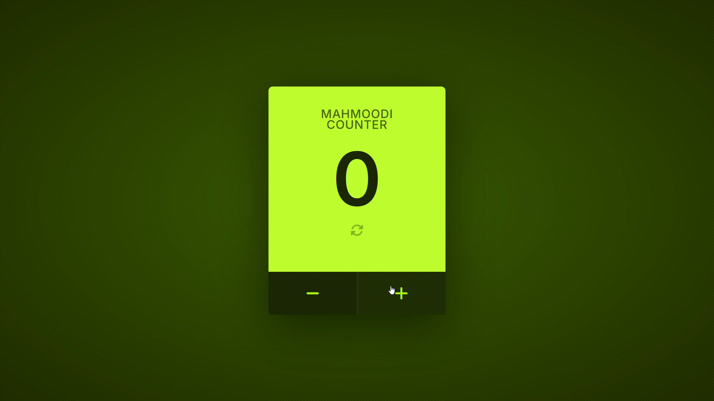

# 🧮 Mahmoodi Counter

A sleek, feature-rich counter application built with vanilla JavaScript. Perfect for practicing core web development fundamentals with a polished, real-world feel.



> **Note:** This project is a part of a larger collection of JavaScript learning exercises.
> **Full Repository & Commit History:** [github.com/AmirPhpDeveloper/learning-js](https://github.com/AmirPhpDeveloper/learning-js)

## ✨ Features

- **Intuitive Controls**: Increment, decrement, and reset with a single click.
- **Keyboard Support**: Full keyboard navigation using `+`, `-`, and `R` keys for a seamless user experience.
- **Persistence**: Your current count is automatically saved to `localStorage` and restored on page load.
- **Visual Feedback**: Dynamic UI changes color and displays messages upon reaching limits.
- **Fully Responsive**: Works flawlessly on both desktop and mobile devices.
- **Clean UI**: Modern design with a custom color palette and smooth interactions.

## 🛠️ Built With

- **HTML5** - For structure and semantics.
- **CSS3** - For styling and responsive design (Flexbox, custom properties).
- **Vanilla JavaScript** - For all logic, DOM manipulation, and state management.
- **Font Awesome** - For high-quality icons.
- **Google Fonts (Inter)** - For a modern and clean typography.

## 🚀 Getting Started

Follow these simple steps to run the project locally.

### Prerequisites

All you need is a modern web browser.

- Google Chrome, Firefox, Safari, or Edge.

### Installation & Running

1.  **Clone the main learning repository** (or download this specific project folder):
    ```bash
    git clone https://github.com/AmirPhpDeveloper/learning-js.git
    ```
2.  **Navigate to the project directory:**
    (The exact path within the repo might be `learning-js/vanilla-js-counter-practice/` or similar)
3.  **Open `index.html`** in your web browser.
    - You can do this by right-clicking the file and selecting "Open With" -> your browser.
    - Or, drag and drop the `index.html` file directly onto an open browser window.

## 📖 How to Use

- **Increment (+):** Click the `+` button or press the `+`/`ArrowUp` key on your keyboard.
- **Decrement (-):** Click the `-` button or press the `-`/`ArrowDown` key.
- **Reset (0):** Click the circular reset icon at the top or press the `R` key.
- **Limits:** The counter is limited between 0 and 5. Reaching a limit will trigger a visual warning and a message.

## 📁 Project Structure

<pre>
vanilla-js-counter-practice/
├── index.html          # Main HTML structure
├── style.css           # All styles and responsive layout
├── script.js           # Core application logic and functionality
├── README.md           # This file
└── demo.gif            # Preview of the application
</pre>

## 🧠 Concepts Practiced

This project demonstrates practical use of:

- **DOM Manipulation:** Selecting, traversing, and updating the DOM.
- **Event Handling:** Adding and working with click and keyboard events.
- **State Management:** Tracking and updating the counter value.
- **Conditional Logic:** Enforcing minimum and maximum limits.
- **Web Storage API:** Using `localStorage` for data persistence between sessions.
- **CSS Styling:** Modern CSS techniques for layout (Flexbox) and visual feedback.

## 🤝 Contributing

This is a learning project, but suggestions are always welcome! Feel free to fork the repository and submit a pull request.

**Happy Coding!** 🚀

## License

## This project is open source and available under the [MIT License](LICENSE).
